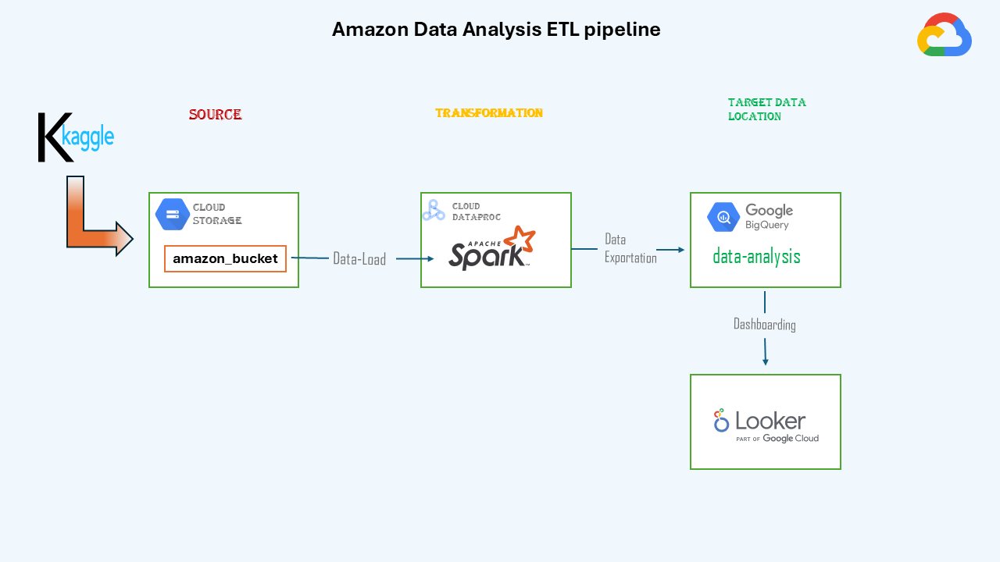

# Amazon-Data-Analysis
This project analyzes Amazon sales data using Google Cloud Platform (GCP), Spark, and Looker Studio. The dataset was sourced from [Kaggle](https://www.kaggle.com/datasets/leylaabdullayeva/amazon-sales-dataset), containing 2.5 million records. This project demonstrates an end-to-end ETL pipeline, from raw data ingestion to responsive dashboard creation.

---

## 📋 Table of Contents
1. [Project Overview](#-project-overview)
2. [Tech Stack](#-tech-stack)
3. [Setup and Installation](-#setup-and-installation)
4. [Workflow](#-workflow)
5. [Repository structure](#repository-structure)
6. [Resources](#-resources) 

---

## 📌 Project Overview
### Objectives:
- Clean and transform raw Amazon sales data.
- Perform data modeling to generate insights.
- Create an interactive dashboard for key analytics.

---

## ⚙ Tech Stack
- **Google Cloud Platform (GCP):** Cloud Storage, Dataproc, BigQuery  
- **Spark:** Data transformation and modeling  
- **Looker Studio:** Dashboarding  
- **Python:** Data handling and scripting  

---

## 🛠️ Setup and Installation  

### Prerequisites  
1. Google Cloud Platform account.  
2. Spark installed on a Dataproc cluster.  
3. Python environment with Jupyter Lab.

### Steps  
1. Clone the repository:  
   ```bash
   git clone https://github.com/shahbaj-cse/Amazon-Data-Analysis.git
   cd Amazon-Data-Analysis
2. pip install -r requirements.txt

---

## 🚀 Workflow  


### 1️⃣ Architecture Overview  
The project architecture outlines the end-to-end data pipeline for **Amazon-Data-Analysis**.  

  

**Key Components:**  
1. **Data Source:** Kaggle dataset with raw Amazon sales data.  
2. **Google Cloud Storage:** Stores raw and transformed data.  
3. **Dataproc Cluster with Spark:** Performs data cleaning, transformation, and modeling.  
4. **BigQuery:** Acts as the data warehouse for storing fact and dimension tables.  
5. **Looker Studio:** Connects to BigQuery for creating interactive dashboards. 

### 1️⃣ Data Ingestion  
**Objective:** Bring raw Amazon sales data into the system for processing.  

1. **Source Data:**  
   - Downloaded from [Kaggle]([resources/kaggle_dataset_link.txt](https://www.kaggle.com/datasets/leylaabdullayeva/amazon-sales-dataset)), containing 2.5 million records with inconsistencies, missing values, and duplicates.  

2. **Data Upload:**  
   - The dataset was uploaded to Google Cloud Storage.  
   - **Bucket Path:** `gs://amazon-data-bucket/raw-data/amazon_sales_data.csv`.  

---

### 2️⃣ Data Transformation  
**Objective:** Clean and prepare data for analysis.  

1. **Environment Setup:**  
   - Created a Dataproc cluster with Spark pre-installed.  
   - Launched Jupyter Lab on the Dataproc cluster for processing.  

2. **Data Cleaning:**  
   - Handled missing values and replaced them with default values for critical fields.  
   - Removed duplicate and invalid entries (e.g., rows with null or incorrect `price` values).  
   - Dropped irrelevant columns to focus on fields contributing to business goals.  

3. **Data Transformation:**  
   - Transformed product names for readability and sorted long text values.  
   - conversion of data types of data filed

4. **Export Transformed Data:**  
   - Stored the cleaned and transformed data in Google Cloud Storage for modeling.  

---

### 3️⃣ Data Modeling  
**Objective:** Create structured schema for efficient querying.  

1. **Fact Table:**  
   - Contained transactional details like order IDs, product IDs, actual price, and rating etc.  

2. **Dimension Tables:**  
   - Product Dimension: Included product details like name and category.   

3. **BigQuery Export:**  
   - Fact and dimension tables were exported to BigQuery for efficient data analysis.  

---

### 4️⃣ Data Analysis  
**Objective:** Use BigQuery to extract actionable insights.  

1. **Query Development:**  
   - Wrote SQL queries to analyze sales trends, product performance, and regional statistics.  

2. **Analytics Table:**  
   - Joined fact and dimension tables to create a dataset for dashboarding, including metrics like total sales, average_rating, and category-level performance.  

---

### 5️⃣ Dashboard Creation  
**Objective:** Visualize insights with Looker Studio.  

1. **Connect BigQuery to Looker Studio:**  
   - Linked the analytics table to Looker Studio for real-time visualization.  

2. **Dashboard Insights:**  
   - Top-selling products by category.  
   - Top reated product.  
   - Poor performing product category.  

3. **Dashboard Output:**  
   - Designed an interactive and responsive dashboard summarizing findings.
   - [Interactive Looker Dashboard](https://lookerstudio.google.com/reporting/a1ba9cb6-dd5f-476a-b672-41d978b10019)
   - [View the Dashboard PDF](Amazon_Dashboard.pdf).

---

## Repository Structure

~~~
Amazon-Data-Analysis/
├── data/
│   ├── raw_data.csv               # Kaggle raw data (optional, or a link)
│   ├── transformed_data.csv       # Cleaned and transformed dataset
│   ├── fact_table.csv             # Exported fact table
│   └── dimension_table.csv        # Exported dimension table
├── notebooks/
│   └── amazon_transformation_pyspark.ipynb # Spark Jupyter Notebook
├── architecture/
│   └── architecture.png            # ETL architecture diagram
├── resources/
│   ├── amazon_dashboard.pdf              # Looker Studio dashboard (downloadable)
│   └── kaggle_dataset_link.txt    # Link to Kaggle dataset
├── README.md                      # Main project description
├── requirements.txt               # Python dependencies
└── .gitignore                     # Ignore unnecessary files
~~~

---

## 📂 Resources

### 1️⃣ Kaggle Dataset  
- **Amazon Sales Dataset:** [Download from Kaggle](resources/kaggle_dataset_link.txt)

### 2️⃣ Data Files  
- **Amazon Data**: you can check the data folder where you will find the all required process data [data](Data)

### 3️⃣ Code  
- **Spark ETL Notebook:** [Download the notebook (IPYNB)](amazon_transformation_pyspark.ipynb)

### 4️⃣ Architecture Diagram  
- **ETL Process Architecture:** [View the diagram](architecture.png)

### 5️⃣ Dashboard  
- **Interactive Dashboard:** [View the dashboard]([resources/dashboard_link.txt](https://lookerstudio.google.com/reporting/a1ba9cb6-dd5f-476a-b672-41d978b10019))  
- **Dashboard PDF:** [Download PDF](Amazon_Dashboard.pdf)

---

## 🎬 That’s All Folks!

Thank you for exploring the **Amazon-Data-Analysis** project! I hope you find it useful and informative. This project demonstrates how to process, transform, and analyze large datasets with Spark, Google Cloud, and BigQuery. Feel free to explore the code, architecture, and results, and reach out if you have any questions or suggestions.

Stay tuned for future updates and improvements!

### 📧 Contact
- GitHub: [GitHub Profile](https://GitHub.com/shahbaj-cse)  
- LinkedIn: [LinkedIn Profile](https://www.linkedin.com/in/shahbaj09)

Happy coding! ✨
